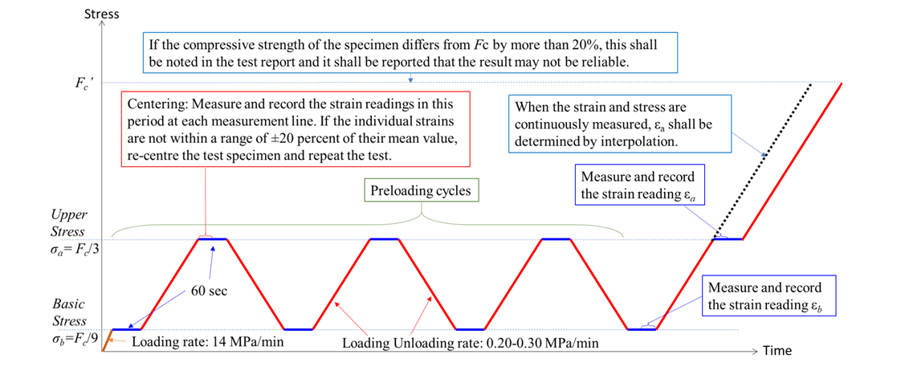

### Introduction

Background: Deformations are induced in concrete structural members due to loads imposed on them. It is often necessary to calculate such deformations, including deflections for the purposes of serviceability, crack control and to consider the secondary effects of such deformations on the forces of the structures (like rib shortening, thermal effects etc). Such deformations become very significant for design of prestressed concrete. Static modulus of elasticity is used to estimate such deformations. In the absence of test values, IS:456 (2000) specifies an approximate formula for this modulus of elasticity as

E = $5000\sqrt{f_{ck}}$

where fck is the characteristic strength of concrete in MPa. This specified value is given after taking long term effects, i.e., creep etc, and other safety factors into account, for design purposes. To know the accurate value of elastic modulus of a concrete batch, laboratory test can be done.

The stress strain curve of concrete, when loaded in compression is not linear. This is because of internal micro cracking which occurs during the application of the load. A virgin specimen generally exhibits more marked curvilinearity. Because of this curvilinear nature of the curve, three types of moduli of elasticity can be defined:

<ul>1. Tangent modulus at a specified strain level</ul>
<ul>2. Initial tangent modulus</ul>
<ul>3. Secant modulus</ul>

It is difficult to determine, from static load test, the initial tangent modulus precisely. Other tests such as resonance vibration or ultrasonic pulse velocity test called dynamic tests can be used to determine it approximately. The secant modulus varies least with increasing stress/strain level and hence has been adopted by all codes of practice to define the static modulus of elasticity. Further, to ensure a degree of consistency, the effects of hysteresis (due to repeated loading and unloading) must be eliminated and the secant value determined at specified stress levels. A specimen which has been loaded and unloaded several times (up to a reasonable level of stress) will exhibit a nearly linear stress strain curve up to 30% to 40% of its ultimate strength.

For design purposes the static modulus of elasticity is considered equivalent to the chord modulus of deformation when the test specimen is loaded Fc/9 MPa and Fc/3 MPa where Fc is average cylindrical compressive strength of concrete at 28 days age. The loading profile for determining the static modulus of elasticity of hardened concrete is shown in the figure below.

<table style="width: 600px">
    <tr style="background-color: #000; color: #FFF; text-align : center;">
       <td colspan="2" style="padding: 10px">Apparatus:</td>
   </tr>
   <tr>
      <td style="padding: 10px">Name</td>
      <td>Remarks</td>
   </tr>
   <tr>
      <td style="padding: 10px">CTM</td>
      <td style="padding: 10px">Conforming to IS 14858. The compression testing machine shall be capable of applying loads at a specified rate and maintaining it at the required level.</td>
   </tr>
   <tr>
      <td style="padding: 10px">Strain measuring apparatus</td>
      <td style="padding: 10px">Dial gauge extensometer – Used for measuring the change in length (B). Shall have a gauge length of not less than two-thirds of the diameter of the test specimen (2/3 d) and shall not exceed its diameter (d)</td>
   </tr>
</table>

Number of specimens:

For measuring the modulus of elasticity- Two cylindrical specimens of preferably diameter 150 mm and height 300 mm casted with the same concrete mix and batch as cubes. For measuring the compressive strength- Three concrete cubes of side 150 mm.

Testing conditions: Normally test shall be made when the specimens reach the age of 28 days.
